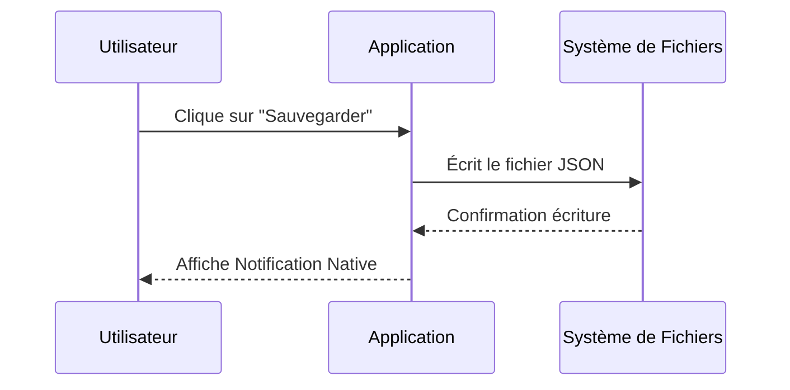

# ➡️ Electron-vite-react : Quentin Ctr

👀 Overview

## 👥 Auteurs

- **Quentin CONTREAU* (Rôle : UI/UX Designer + Dev Deskotp) - [[https://github.com/Tokennn]](https://github.com/Tokennn])

## 🛫 Quick Setup  


## 📐 UML (Projet actuel)

- Plan UML detaille et structure: [`doc/UML.md`](doc/UML.md)

```markdown


## 📄 Description
Une phrase d'accroche ("Pitch").
Description détaillée de ce que fait l'application, pourquoi elle existe, et à qui elle s'adresse.

### Fonctionnalités Clés

> ⚠️ **Focus Desktop :** [Décrire ici la fonctionnalité native implémentée, ex: "L'application se réduit dans le System Tray et envoie une notification native à la fin d'un téléchargement."]

* [x] Feature 1 (ex: Gestion des utilisateurs)
* [x] Feature 2 (ex: Export PDF)
* [ ] Feature 3 (Non implémentée / À venir)

## 🎨 Conception & Design
> Lien vers la maquette complète (Figma ou Penpot).
> **[Voir la maquette sur Figma](Lien_Public_Figma)**

Insérez ici une vue globale de la maquette exportée en image pour l'aperçu rapide.

## 📐 Architecture & UML
> Pas de diagrammes de classes générés automatiquement et illisibles !
> Seuls les diagrammes **PERTINENTS** pour comprendre la logique métier (Use Case, Sequence, ou un Class Diagram ciblé sur le cœur du système).

**Intégration via Mermaid JS ou PlantUML obligatoire :**



## 🛠 Stack Technique

- **Langage :** Java script ; Vite
- **Framework :** Electron ; React ; Node js 
- **Outils :** Figma ; Cursor

---

## 📸 Démonstration (Screenshots & Gifs)

> Une image vaut mille mots, une animation en vaut dix mille.  
> **Les Gifs animés ou courtes vidéos montrant l'interaction sont vivement recommandés.**


| Écran d'accueil | Démo Interaction (Gif) |
| --------------- | ---------------------- |
| Accueil         | Démo                   |


---

## 🚀 Installation & Lancement

Guide pas-à-pas pour qu'un développeur puisse lancer votre projet.

```bash
# Cloner le dépôt
git clone [https://github.com/votre-user/votre-projet.git](https://github.com/votre-user/votre-projet.git)

# Installer les dépendances
npm install / pip install -r requirements.txt

# Lancer l'application
npm start / python main.py
```

---

### 🏗️ Structure

```text
/assets       (Images, logos, Gifs de démo)
/src          (Code source)
/doc          (Exports PDF des maquettes, Diagrammes supplémentaires)
.gitignore    (Indispensable ! Pas de /node_modules ou /bin)
README.md     (Le rapport final complet)
LICENSE       (MIT ou Apache)
```

---

## 📸 Démonstration (Screenshots & Gifs)

> Une image vaut mille mots, une animation en vaut dix mille.  
> **Les Gifs animés ou courtes vidéos montrant l'interaction sont vivement recommandés.**


| Écran d'accueil | Démo Interaction (Gif) |
| --------------- | ---------------------- |
| Accueil         | Démo                   |


---

## 🚀 Installation & Lancement

Guide pas-à-pas pour qu'un développeur puisse lancer votre projet.

```bash
# Cloner le dépôt
git clone [https://github.com/votre-user/votre-projet.git](https://github.com/votre-user/votre-projet.git)

# Installer les dépendances
npm install / pip install -r requirements.txt

# Lancer l'application
npm start / python main.py
```

---

## 🤖 Section IA & Méthodologie (OBLIGATOIRE)

*Transparence totale requise sur l'usage de l'IA (ChatGPT, Copilot, Gemini).*

### 1. Prompts Utilisés

- *"Explique-moi comment centrer une div en CSS grid"* -> Pour comprendre le layout.
- *"Génère une classe User en C#"* -> Pour le boilerplate.

### 2. Modifications Manuelles & Debug

- L'IA a proposé d'utiliser une librairie dépréciée (`x`), nous l'avons remplacée par `y`.
- Le code généré pour la boucle `for` était infini, nous l'avons corrigé manuellement ligne 42.

### 3. Répartition Code IA vs Code Humain

- **Boilerplate / Config :** 80% IA.
- **Logique Métier (Algorithme) :** 100% Humain.
- **Interface (UI) :** 50% IA / 50% Humain.

---

## ⚖️ Auto-Évaluation

- **Ce qui fonctionne bien :** ...
- **Difficultés rencontrées :** ...
- **Si c'était à refaire :** ...

```

```
