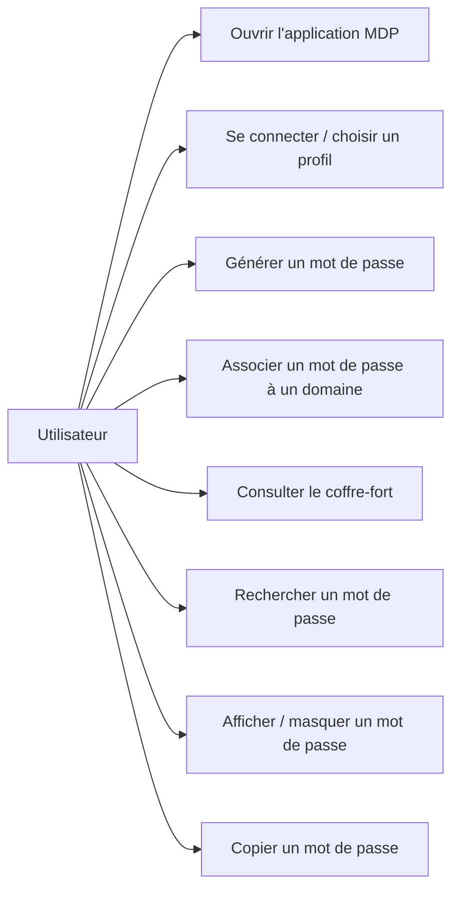

# ➡️ Electron-vite-react : Quentin Ctr

👀 Overview

## 👥 Auteurs

- **Quentin CONTREAU* (Rôle : UI/UX Designer + Dev Desktop) - [[https://github.com/Tokennn]](https://github.com/Tokennn])

## 🛫 Quick Setup  


## 📐 UML (Projet actuel)

- Plan UML detaille et structure: [`doc/UML.md`](doc/UML.md)

## 📄 Description
Application de gestion et de stockage de mot de passe en fonction du site web auquel on l'affecte..

### Fonctionnalités Clés

> ⚠️ **Focus Desktop :** [L’interface reproduit visuellement un bureau d’ordinateur (barre du haut, dock, icônes), mais une seule application est réellement fonctionnelle et lançable : le gestionnaire de mots de passe. Les autres éléments servent de décor/repères UX pour simuler un environnement desktop.]

* [x] Feature 1 : Login
* [x] Feature 2 : Génération mdp + Intégration du site 
* [x] Feature 3 : Visualisation / Listing des mots de passe en fonction de leur nom de domaine 
* [x] Feature 4 : Modification profile
* [x] Feature 5 : Extraction PDF ou autre.. (à faire)

## 🎨 Conception & Design
> Lien vers la maquette complète (Figma).
> **[Voir la maquette sur Figma](https://www.figma.com/design/xRihqpY6yq7j2GvFPsFW8J/MacBook.x.Electron?node-id=0-1&t=s9odWvPNl8Sh0vZo-1)**


## 📐 Architecture & UML
Architecture en 3 couches :
- **Renderer (`src/`)** : interface React (bureau visuel + gestionnaire de mots de passe).
- **Main (`electron/main/`)** : cycle de vie Electron et APIs natives.
- **Preload (`electron/preload/`)** : pont IPC sécurisé entre UI et process principal.

### Use Case (fonctionnel)

```mermaid
flowchart LR
    U[Utilisateur] --> A[Ouvrir l'application MDP]
    U --> B[Se connecter / choisir un profil]
    U --> C[Générer un mot de passe]
    U --> D[Associer un mot de passe à un domaine]
    U --> E[Consulter le coffre-fort]
    U --> F[Rechercher un mot de passe]
    U --> G[Afficher / masquer un mot de passe]
    U --> H[Copier un mot de passe]
```


## 🛠 Stack Technique

- **Langage :** Java script ; Vite
- **Framework :** Electron ; React ; Node js 
- **Outils :** Figma ; Cursor

---

## 📸 Démonstration (Screenshots & Gifs)


---

## 🚀 Installation & Lancement

Guide pas-à-pas pour qu'un développeur puisse lancer votre projet.

```bash
# Cloner le dépôt
git clone (https://github.com/Tokennn/MacBook_Desktop-Electron.git)

# Installer les dépendances
npm install i

# Lancer l'application
npm run dev
```

---

### 🏗️ Structure

```text
/src                  (Interface React : écrans, composants, styles, assets UI)
/electron             (Processus main + preload Electron)
/public               (Fichiers statiques servis par Vite)
/doc                  (UML et documentation projet)
/build                (Icônes de build Electron : .icns/.ico/.png)
README.md             (Documentation principale du projet)
package.json          (Scripts et dépendances)
vite.config.ts        (Configuration Vite)
electron-builder.json (Configuration packaging desktop)
.gitignore            (Exclusions Git)
LICENSE               (Licence du projet)
```

---

## 📸 Démonstration (Screenshots & Gifs)

> Une image vaut mille mots, une animation en vaut dix mille.  
> **Les Gifs animés ou courtes vidéos montrant l'interaction sont vivement recommandés.**


| Écran d'accueil | Démo Interaction (Gif) |
| --------------- | ---------------------- |
| Accueil         | Démo                   |


---

## 🚀 Installation & Lancement

Guide pas-à-pas pour qu'un développeur puisse lancer votre projet.

```bash
# Cloner le dépôt
git clone [https://github.com/votre-user/votre-projet.git](https://github.com/votre-user/votre-projet.git)

# Installer les dépendances
npm install / pip install -r requirements.txt

# Lancer l'application
npm start / python main.py
```

---

## 🤖 Section IA & Méthodologie (OBLIGATOIRE)

*Transparence totale requise sur l'usage de l'IA (ChatGPT, Copilot, Gemini).*

### 1. Prompts Utilisés

- *"Explique-moi comment centrer une div en CSS grid"* -> Pour comprendre le layout.
- *"Génère une classe User en C#"* -> Pour le boilerplate.

### 2. Modifications Manuelles & Debug

- L'IA a proposé d'utiliser une librairie dépréciée (`x`), nous l'avons remplacée par `y`.
- Le code généré pour la boucle `for` était infini, nous l'avons corrigé manuellement ligne 42.

### 3. Répartition Code IA vs Code Humain

- **Boilerplate / Config :** 80% IA.
- **Logique Métier (Algorithme) :** 100% Humain.
- **Interface (UI) :** 50% IA / 50% Humain.

---

## ⚖️ Auto-Évaluation

- **Ce qui fonctionne bien :** ...
- **Difficultés rencontrées :** ...
- **Si c'était à refaire :** ...
