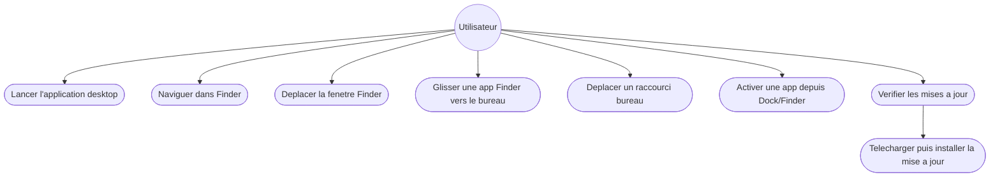
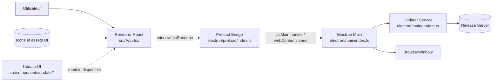
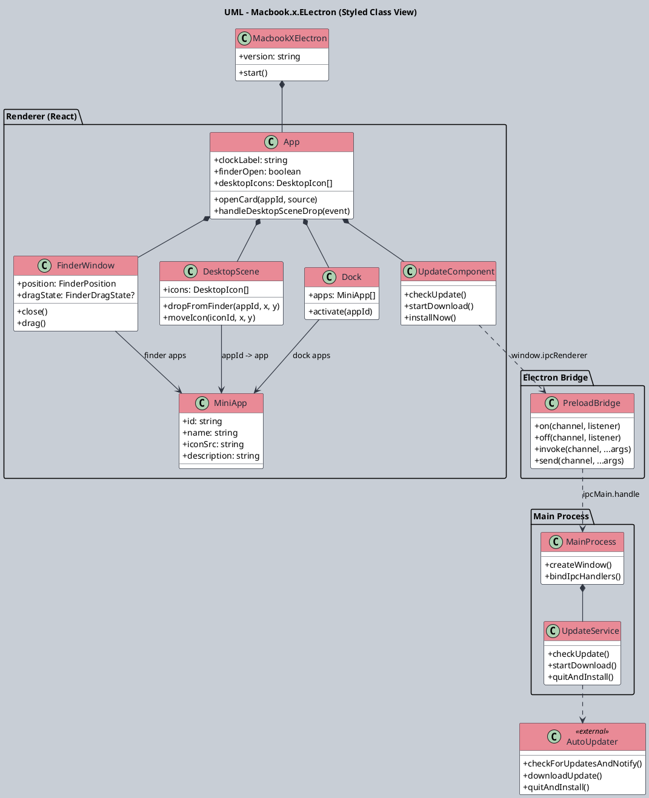
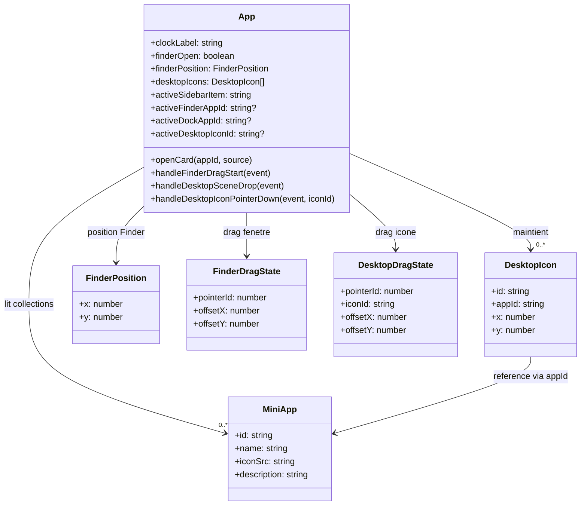
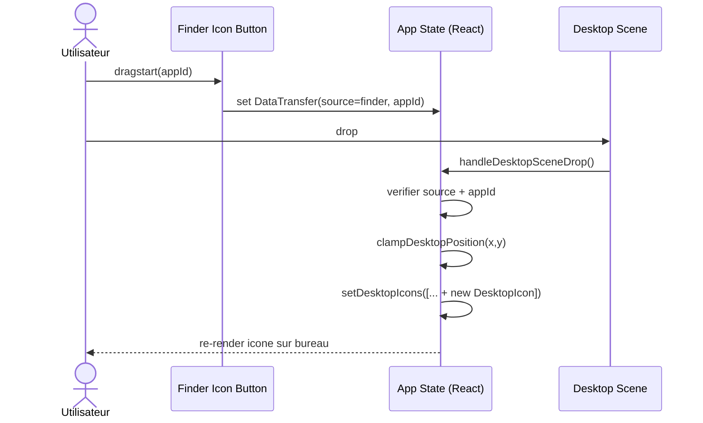
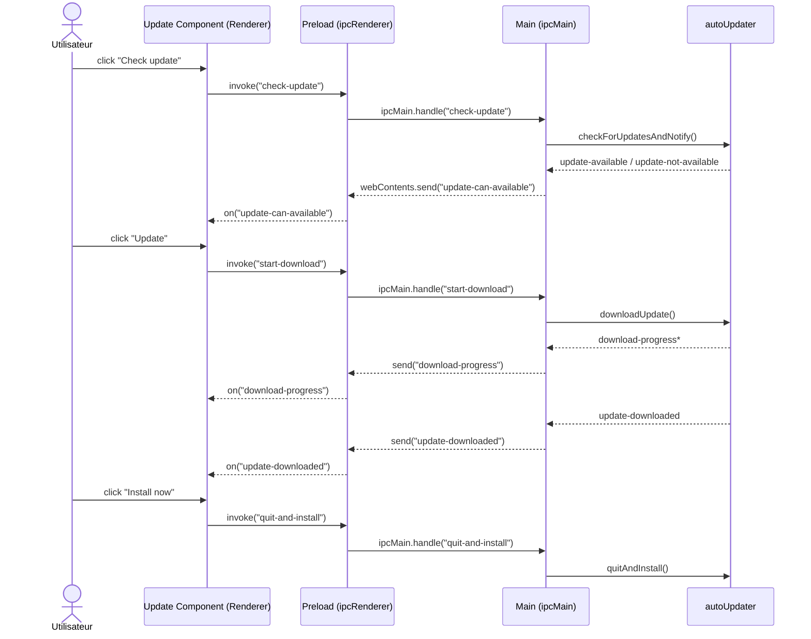
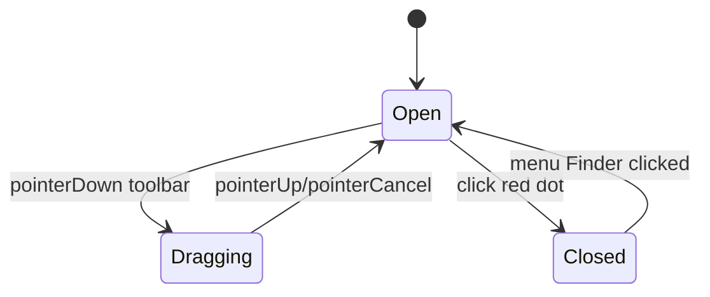

# Plan UML - Macbook.x.ELectron

Ce document decrit un plan UML base sur l'etat actuel du projet Electron + React.

## 1) Scope UML

- UX ciblee: desktop type macOS (Finder, Dock, top bar, desktop shortcuts).
- Couches techniques: Electron Main, Preload Bridge, React Renderer.
- Flux critiques modelises: interactions UI (drag/drop) et mise a jour applicative (IPC + electron-updater).

## 2) Use Case (niveau produit)

## 3) Component Diagram (niveau architecture)

## 4) Diagramme UML stylise (proche du rendu de ton exemple)

## 5) Class Diagram cible (coeur interaction UI, Mermaid fallback)

## 6) Sequence - Drag Finder vers Desktop

## 7) Sequence - Check Update via IPC

## 8) State Diagram - Finder Window

## 9) References code

- `src/App.tsx`: modeles UI, etats React, drag/drop Finder/Desktop.
- `electron/preload/index.ts`: exposition securisee `window.ipcRenderer`.
- `electron/main/index.ts`: lifecycle Electron, BrowserWindow, binding update service.
- `electron/main/update.ts`: handlers IPC de mise a jour + pont vers `electron-updater`.
- `src/components/update/index.tsx`: UI de check/download/install update (module present dans le code).
